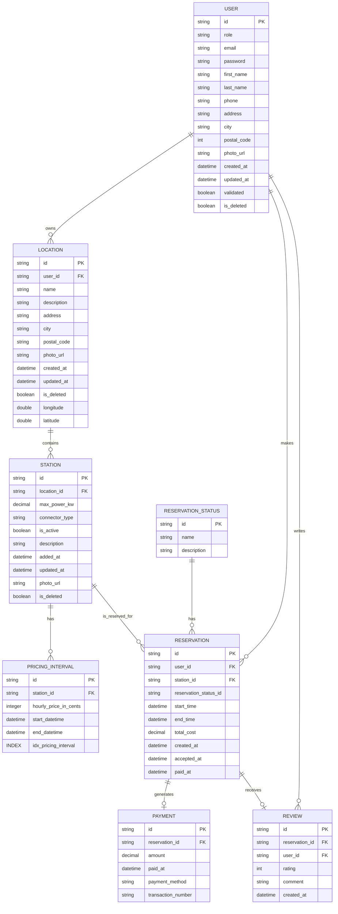

# Modèle Conceptuel de Données (MCD) et Modèle Logique de Données (MLD) pour Electricity Business

---

## **Utilisateur (USER)**
Représente les personnes inscrites sur la plateforme. Un utilisateur peut proposer des localisations de recharge, faire des réservations, écrire des avis et (hors diagramme actuel) recevoir des notifications liées à ses activités.

- Un utilisateur **possède** une ou plusieurs **localisations de recharge**.
- Un utilisateur **effectue** une ou plusieurs **réservations**.
- Un utilisateur **rédige** zéro, une ou plusieurs **avis (REVIEW)**.

## **Localisation de Recharge (LOCATION)**
Lieu physique où une ou plusieurs bornes sont installées. Chaque localisation appartient à un utilisateur.

- Une localisation **appartient** à un seul **utilisateur**.
- Une localisation **contient** une ou plusieurs **bornes de recharge (STATION)**.

## **Borne de Recharge (STATION)**
Unité de recharge individuelle qui peut être réservée. Elle est rattachée à une localisation et peut avoir des intervalles tarifaires et des réservations.

- Une borne **fait partie** d'une localisation.
- Une borne **a** zéro, un ou plusieurs **intervalles tarifaires (PRICING_INTERVAL)** définissant le coût sur des plages temporelles.
- Une borne **est concernée** par zéro, une ou plusieurs **réservations (RESERVATION)**.

## **Intervalle Tarifaire / Créneau Horaire Tarifé (PRICING_INTERVAL)**
Définit une fenêtre temporelle (début / fin) avec un prix horaire. C’est l’unité de tarification appliquée à une station sur une période donnée.

- Un intervalle tarifaire **appartient** à une et une seule **borne (STATION)**.

## **Réservation (RESERVATION)**
Demande d’utilisation d’une borne par un utilisateur pour une période donnée, avec suivi de son état, coût, paiement, etc.

- Une réservation **est faite** par un seul **utilisateur**.
- Une réservation **concerne** une seule **borne (STATION)**.
- Une réservation **a** un et un seul **statut de réservation (RESERVATION_STATUS)**.
- Une réservation **génère** zéro ou un seul **paiement (PAYMENT)**.
- Une réservation **reçoit** zéro ou un seul **avis (REVIEW)**.

## **Statut de Réservation (RESERVATION_STATUS)**
Catalogue des états possibles d’une réservation (ex. : en attente, confirmée, refusée, terminée).

- Un statut **peut être lié** à zéro, une ou plusieurs **réservations**.

## **Paiement (PAYMENT)**
Représente la transaction financière associée (le cas échéant) à une réservation.

- Un paiement **est généré** par une et une seule **réservation**.

## **Avis (REVIEW)**
Retour écrit d’un utilisateur sur une réservation effectuée.

- Un avis **est lié** à une et une seule **réservation**.
- Un avis **est rédigé** par un et un seul **utilisateur**.

---

**Remarques de cohérence :**
- Le terme "PRICING_INTERVAL" couvre à la fois la notion de créneau horaire et de tarif — en phase MVP, on gère les prix par intervalle temporel explicite.
- Le statut de réservation pourrait, à terme, être simplifié en énumération si les valeurs sont fixes et non modifiables dynamiquement depuis l’UI.

