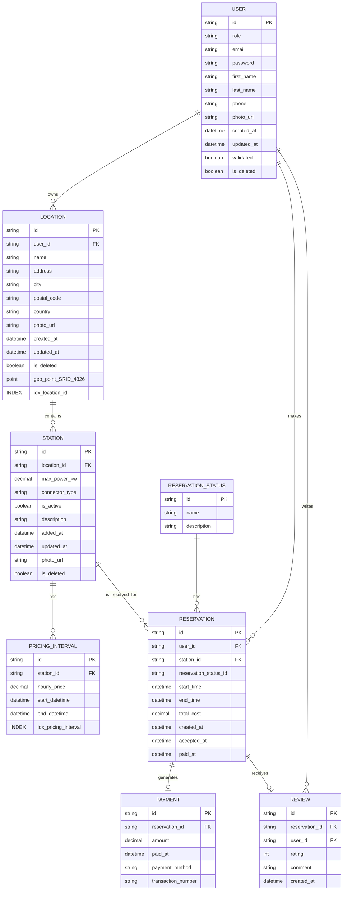

# Modèle Conceptuel de Données (MCD) et Modèle Logique de Données (MLD) pour Electricity Business

---
### **Utilisateur (USER)**  
Représente les personnes inscrites sur la plateforme. Un utilisateur peut proposer des bornes à la location, effectuer des réservations de bornes, et recevoir des notifications liées à ses activités.

- Un utilisateur **possède** une ou plusieurs **localisations de recharge**.
- Un utilisateur **effectue** une ou plusieurs **réservations**.
- Un utilisateur **reçoit** une ou plusieurs **notifications**.

### **Localisation de Recharge (CHARGING_LOCATION)**  
Correspond aux lieux physiques où les bornes de recharge sont installées. Chaque localisation appartient à un utilisateur précis.

- Une localisation de recharge **appartient** à un et un seul **utilisateur**.
- Une localisation de recharge **contient** une ou plusieurs **bornes de recharge**.

### **Borne de Recharge (CHARGING_STATION)**  
Représente chaque borne individuelle disponible à la réservation au sein d'une localisation donnée.

- Une borne de recharge **fait partie** d'une seule **localisation de recharge**.
- Une borne de recharge **possède** un ou plusieurs **tarifs (RATES)** associés.
- Une borne de recharge **fait l’objet** de zéro, une ou plusieurs **réservations**.
- Une borne de recharge **propose** de zéro, une ou plusieurs **créneau horaire**.

### **Tarif (RATE)**  
Permet de définir des tarifs spécifiques (par exemple, horaires). Tarif peut ensuite être appliqué à une station de recharge dans un créneau horaire definit.

- Un tarif **s'applique** à une et un seule **créneau horaire**.

### **Paiement (PAYMENT)**  
Correspond aux transactions financières réalisées suite à une réservation.

- Un paiement **est généré** par une et une seule **réservation**.

### **Avis (REVIEW)**  
Permet à un utilisateur d’évaluer son expérience après une réservation.

- Un avis **est lié** à une et une seule **réservation**.
- Un avis **est rédigé** par un et un seul **utilisateur**.

### **Notification (NOTIFICATION)**  
Messages envoyés à un utilisateur, liés à divers événements (confirmation de réservation, rappel, avis, etc.).

- Une notification **est destinée** à un seul **utilisateur**.

### **Réservation (RESERVATION)**  
Représente la réservation effectuée par un utilisateur pour utiliser une borne pendant une période déterminée.

- Une réservation **est effectuée** par un seul **utilisateur**.
- Une réservation **concerne** une seule **borne de recharge**.
- Une réservation **génère** zéro ou un seul **paiement**.
- Une réservation **reçoit** zéro ou un seul **avis (review)** de la part de l'utilisateur.
- Une réservation **possède** un et un seul **statut de réservation**.

### **Statut de Réservation (RESERVATION_STATUS)**  
Définit les différents états possibles d'une réservation (en attente de confirmation, confirmée, refusée, terminée, etc.).

- Un statut de réservation **peut concerner** zéro, une ou plusieurs **réservations**.

### **Créneau horaire (TIME_SLOT)**
Le créneau horaire est proposé par l'utilisateur en fonction de ses besoins. Il a la possibilité de déterminer le coût d'un créneau individuel. Pour plus de commodité, des scripts de création massive de créneaux horaires seront mis en œuvre (par exemple, pour une semaine à l'avance ou pour un mois). 

---

